<p align="center">
  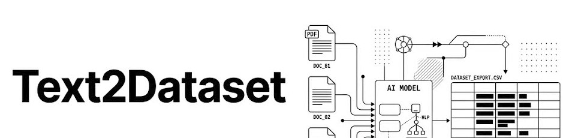
</p>

<h3 align="center">
AI-powered document intelligence pipeline for transforming unstructured documents into structured machine-learning-ready datasets.
</h3>

<p align="center">
  <a href="#features">Features</a> •
  <a href="#architecture">Architecture</a> •
  <a href="#example-dataset-generation">Example Output</a> •
  <a href="#screenshots">Screenshots</a> •
  <a href="#tech-stack">Tech Stack</a>
</p>

<p align="center">


</p>

---

# What is Text2Dataset?

Text2Dataset is an AI-powered document intelligence platform designed to transform unstructured documents into structured datasets for machine learning, NLP, and data engineering workflows.

The platform processes:
- PDFs
- scanned documents
- DOCX files
- raw text files

and converts them into:
- structured JSON datasets
- CSV exports
- spaCy training datasets

through a multi-stage NLP and preprocessing pipeline.

Unlike generic document converters, Text2Dataset focuses on:
- intelligent entity extraction
- OCR fallback handling
- preprocessing automation
- normalization workflows
- scalable dataset generation
- training-data-ready outputs

The goal was to build a system that feels less like:
> “a converter tool”

and more like:
> “a document intelligence pipeline for AI workflows.”

---

# Why I Built This

While working with NLP and dataset preparation workflows, I realized most document extraction tools fail in real-world conditions.

Common issues included:
- scanned PDFs with no selectable text
- malformed UTF-8 encoding
- noisy OCR outputs
- inconsistent entity extraction
- broken training-data formatting
- unusable character offsets

Most tools handled:
- basic parsing

but struggled with:
- preprocessing
- normalization
- scalable extraction workflows
- production-ready dataset generation

Text2Dataset was built to solve those problems through:
- multi-stage preprocessing
- configurable extraction pipelines
- OCR fallback systems
- structured export workflows
- collaborative dataset tooling

---

# Features

## Multi-Format Document Ingestion

Text2Dataset supports multiple document formats for flexible ingestion workflows.

### Supported Formats
- PDF
- scanned PDF
- DOCX
- TXT

### Features
- automatic file validation
- OCR fallback handling
- preprocessing-ready ingestion
- text extraction workflows
- scalable upload pipeline

---

## Intelligent Extraction Modes

The platform includes three configurable extraction modes optimized for different precision/speed tradeoffs.

### Fast Mode
- spaCy-based NER
- optimized low-latency extraction
- lightweight inference workflow

### Smart Mode
- rule-enhanced entity extraction
- improved filtering logic
- category-aware processing

### Enhanced Mode
- transformer-powered extraction
- BERT-based NER
- zero-shot classification
- highest extraction precision

---

## OCR Fallback Pipeline

One of the platform’s core engineering features is automatic OCR fallback for scanned or image-based PDFs.

### Features
- scanned PDF detection
- OCR-based text extraction
- fallback parsing workflows
- resilient document handling

The system automatically detects low-text PDFs and routes them through OCR processing using:
- pdf2image
- pytesseract

---

## Advanced Text Normalization

The preprocessing pipeline includes extensive normalization and cleanup systems.

### Features
- UTF-8 normalization
- malformed character correction
- punctuation cleanup
- whitespace normalization
- token cleanup
- duplicate handling
- encoding repair

The platform includes 28+ normalization mappings for handling real-world corrupted document inputs.

---

## Structured Dataset Generation

Text2Dataset converts extracted entities into machine-learning-ready structured datasets.

### Supported Outputs
- JSON
- CSV
- spaCy training format

### Features
- structured entity rows
- confidence scoring
- token-aligned entity offsets
- downloadable dataset exports
- schema consistency

---

## Community & Collaboration System

The platform includes collaborative dataset workflows for shared NLP pipelines.

### Features
- shared datasets
- collaborative editing
- dataset collections
- version tracking
- comments & discussions
- global community workflows

---

# Architecture

## High-Level System Architecture

<p align="center">
  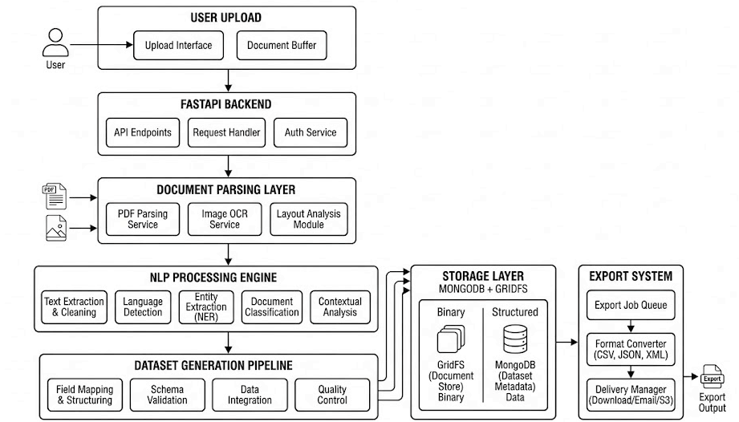
</p>

---

## Document Ingestion Pipeline

<p align="center">
  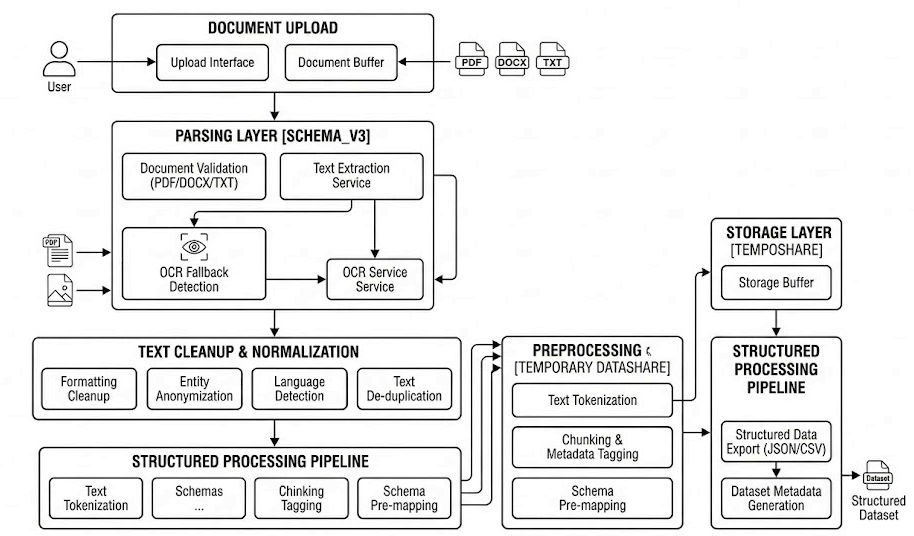
</p>

---

## NLP Processing Pipeline

<p align="center">
  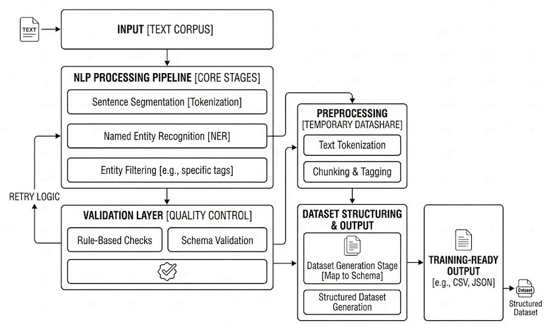
</p>

---

## OCR Fallback Workflow

<p align="center">
  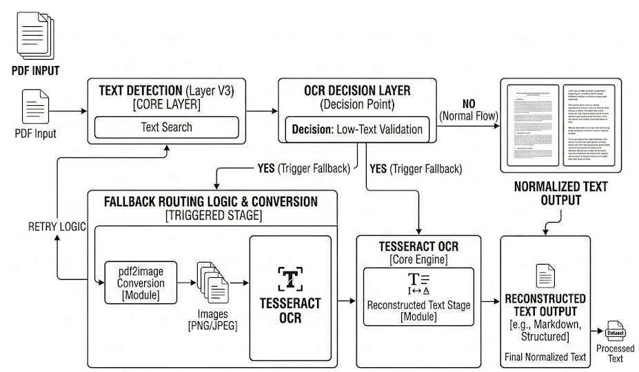
</p>

---

## Export Pipeline

<p align="center">
  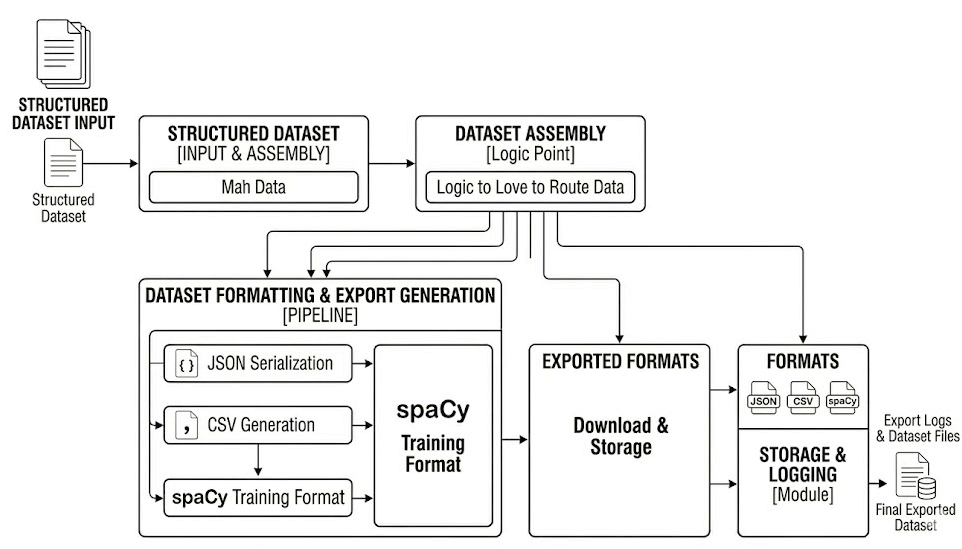
</p>

---

# How the Pipeline Works

```text
PDF / DOCX / TXT Upload
            ↓
Document Validation
            ↓
Text Extraction
            ↓
OCR Fallback Detection
            ↓
Text Cleanup & Normalization
            ↓
Named Entity Recognition
            ↓
Entity Filtering & Validation
            ↓
Structured Dataset Assembly
            ↓
JSON / CSV / spaCy Export
```

---

# Example Dataset Generation

## Sample Input

```text
Apple Inc. is an American multinational technology company headquartered in Cupertino, California.

It was founded by Steve Jobs, Steve Wozniak, and Ronald Wayne in April 1976.

Apple's products include the iPhone, iPad, Mac, iPod, Apple Watch, Apple TV, and AirPods.
```

---

## Enhanced (BERT) Extraction Output

```json
[
  {
    "entity": "Apple Inc",
    "label": "ORG",
    "confidence": 0.9994
  },
  {
    "entity": "Cupertino",
    "label": "LOC",
    "confidence": 0.9976
  },
  {
    "entity": "Steve Jobs",
    "label": "PER",
    "confidence": 0.9991
  },
  {
    "entity": "iPhone",
    "label": "MISC",
    "confidence": 0.9761
  },
  {
    "entity": "Apple Watch",
    "label": "MISC",
    "confidence": 0.9709
  }
]
```

---

## Extraction Metadata

Generated datasets include:
- entity labels
- confidence scores
- token offsets
- contextual keyphrases
- embedding availability
- structured export formatting

---

## Real-World NLP Challenges

Transformer-based extraction pipelines often produce:
- fragmented subword tokens
- overlapping spans
- malformed entities
- tokenizer artifacts

Example:
```json
{
  "entity":"##ife",
  "label":"MISC"
}
```

Text2Dataset includes:
- filtering layers
- normalization workflows
- validation systems
- overlap handling

to improve downstream dataset quality.

---

# Extraction Architecture

## Fast Mode

Optimized for lightweight high-speed extraction using spaCy-based entity recognition.

### Best For
- rapid extraction
- lightweight processing
- low-latency workflows
- batch pipelines

---

## Smart Mode

Combines rule-based validation with enhanced filtering logic.

### Best For
- balanced precision/speed
- cleaner entity extraction
- preprocessing-heavy workflows

---

## Enhanced Mode

Uses transformer-based NLP pipelines for maximum extraction precision.

### Features
- BERT NER
- zero-shot classification
- contextual entity understanding
- embedding-aware extraction

### Best For
- advanced NLP workflows
- research pipelines
- high-quality dataset generation

---

# Key Engineering Highlights

- Built a multi-mode NLP extraction architecture with configurable precision/speed tradeoffs
- Implemented OCR fallback workflows for scanned document handling
- Designed advanced UTF-8 normalization and malformed text correction systems
- Implemented token-aligned spaCy export generation with accurate entity offsets
- Built async FastAPI infrastructure with concurrent request handling
- Added MongoDB + GridFS integration for scalable file storage
- Implemented collaborative dataset-sharing and versioning workflows
- Designed lazy-loading transformer inference pipelines for performance optimization

---

# Tech Stack

## Backend
- FastAPI
- Python
- Uvicorn
- Pydantic

---

## NLP & AI
- spaCy
- Transformers
- PyTorch
- sentence-transformers
- NLTK

---

## Document Processing
- pypdf
- pdf2image
- pytesseract
- python-docx
- Pillow

---

## Data & Infrastructure
- MongoDB Atlas
- GridFS
- pandas
- NumPy
- bcrypt

---

# Repository Structure

```bash
text2dataset/
│
├── templates/
├── static/
├── uploads/
├── exports/
├── cache/
│
├── app.py
├── document_parser.py
├── enhanced_nlp.py
├── labeling_fast.py
├── labeling_smart.py
├── preprocess.py
├── exporter.py
├── auth.py
├── cache.py
├── dataset_history.py
├── community_datasets.py
│
├── requirements.txt
├── railway.json
└── README.md
```

---

# Screenshots

## Homepage

<p align="center">
  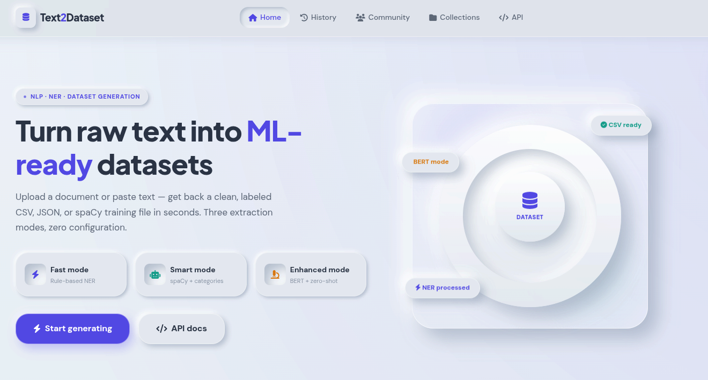
</p>

---

## Dataset Generation Workflow

<p align="center">
  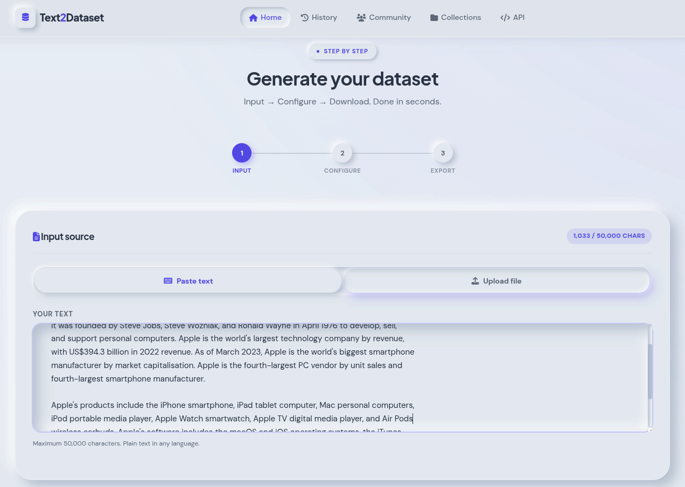
</p>

---

## Extraction Modes & Export Options

<p align="center">
  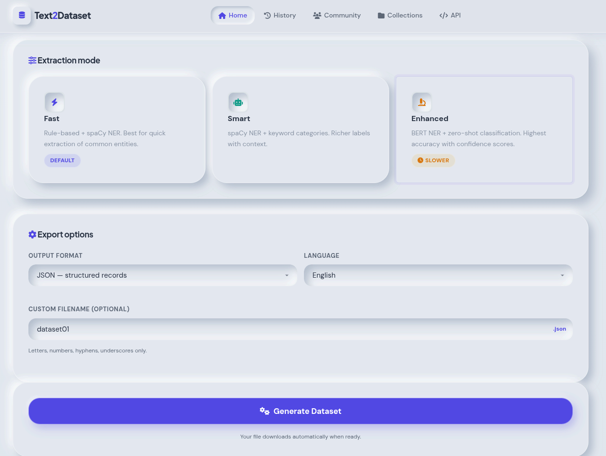
</p>

---

## Community Datasets

<p align="center">
  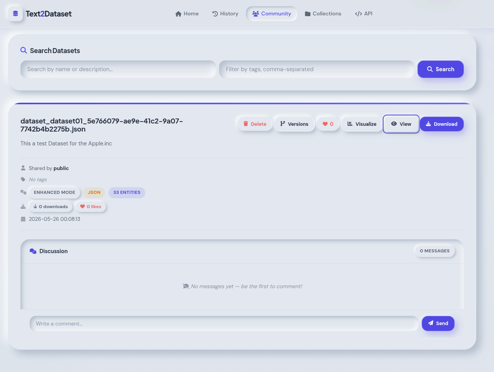
</p>

---

## Dataset History

<p align="center">
  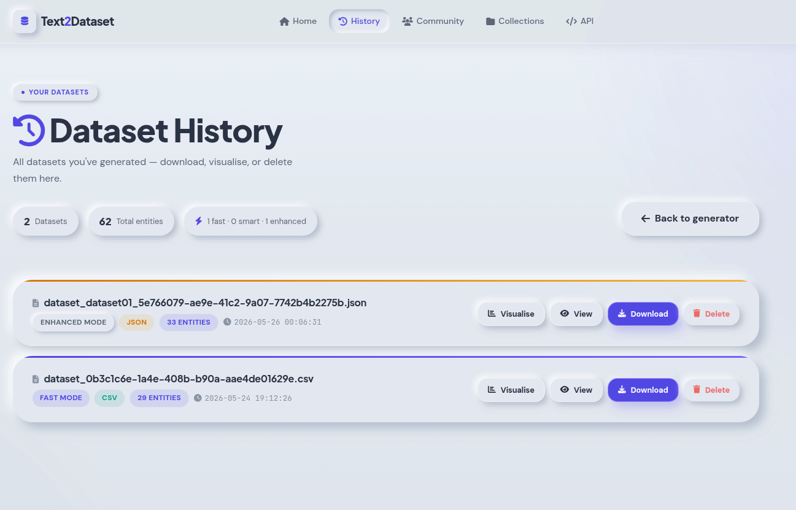
</p>

---

# Engineering Challenges

## The Scanned PDF Problem

Many extraction systems fail completely on scanned or image-based PDFs.

Text2Dataset solves this by:
- detecting low-text documents automatically
- routing documents through OCR fallback workflows
- rebuilding extractable text using Tesseract OCR

This significantly improves real-world document compatibility.

---

## UTF-8 & Encoding Corruption

Documents from different sources often contain:
- malformed symbols
- broken UTF-8 characters
- corrupted punctuation
- inconsistent spacing

The preprocessing pipeline includes:
- normalization mappings
- token cleanup
- whitespace correction
- malformed character repair

to improve downstream extraction quality.

---

## Entity Noise Reduction

Raw NER pipelines produce significant extraction noise.

The platform uses:
- multi-layer filtering
- overlap handling
- stop-word filtering
- validation systems
- rule-enhanced extraction

to improve structured dataset quality.

---

## Accurate spaCy Export Generation

Generating proper spaCy training datasets requires accurate entity offsets.

Instead of naive string matching, Text2Dataset uses:
- token-aligned matching
- overlap-safe extraction
- structured entity alignment

to generate training-ready outputs.

---

## Transformer Inference Optimization

Large NLP models significantly increase startup overhead and memory usage.

The system uses:
- lazy model loading
- GPU/CPU auto-detection
- graceful fallback strategies

to optimize inference workflows.

---

# Performance & Infrastructure

Text2Dataset includes:
- async request handling
- concurrent processing workflows
- caching systems
- scalable file storage
- GridFS large-file handling
- thread-safe processing workflows
- rate limiting

The platform is designed for:
- concurrent users
- scalable NLP processing
- batch extraction workflows

---

# Future Improvements

- vector search integration
- semantic document clustering
- LLM-assisted extraction workflows
- advanced OCR models
- workflow automation pipelines
- dataset quality scoring
- streaming extraction workflows
- multi-document relationship mapping

---

# Project Positioning

Text2Dataset is best positioned as:
- a document intelligence platform
- a structured dataset extraction pipeline
- an NLP preprocessing workflow system
- an AI-assisted data engineering tool

The strongest aspect of the project is its combination of:
- OCR fallback systems
- preprocessing infrastructure
- NLP extraction pipelines
- scalable async architecture
- training-data-ready exports

into a unified document processing workflow.

---

# Project Status

> Active Development

Text2Dataset continues evolving with ongoing improvements across:
- NLP pipelines
- extraction quality
- preprocessing workflows
- collaborative tooling
- infrastructure scalability

---

# Author

## Ehaan Dadarkar

- Portfolio: https://ed-port.vercel.app
- LinkedIn: https://linkedin.com/in/ehaan-dadarkar-1694a8351
- GitHub: https://github.com/Ehaan-Dadarkar